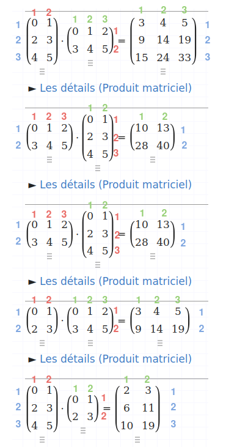
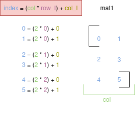
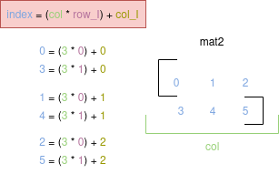

 <center><h2><ins>Multiply vectors as if they were matrices</ins></h2></center>

The aim of this project is to be able to do the multiplication of two matrices, but from two vectors. 

The motivation behind this is to make the gradient descent methods (from this project) work with matrices to train multiple neurons on the same layer.

<h3><ins>The problem.</ins></h3>

The function created takes two vectors as inputs :

$$\textrm{vector1} = \begin{bmatrix}
0 & 1 & 2 & 3 & 4 & 5
\end{bmatrix}$$

$$\textrm{vector2} = \begin{bmatrix}
0 & 1 & 2 & 3 & 4 & 5
\end{bmatrix}$$

If we wanted to manipulate these vectors as matrices, we would have to rearrange them, but there are many ways of doing this:

possibility 1: 

$$\begin{matrix}[0 & 1 & 2 & 3 & 4 & 5]\end{matrix}$$

possibility 2: 

$$\begin{matrix}[0 &1 & 2\\
3 & 4 & 5]\end{matrix}$$

possibility 3: 

$$\begin{matrix}[0 & 1\\
2 & 3\\ 
4 & 5]\end{matrix}$$

possibility 4: 

$$\begin{matrix}[0 \\ 
1\\ 
2\\ 
3\\ 
4\\ 
5]\end{matrix}$$

We can't choose one of them without informations about the number of rows/columns we want for the result matrix.

We, at least, need to either the rows or the columns of the matrix we would have as the result, this the third argument of the function.

And there is three relation during a multiplication between two matrix we can use :

$$\textrm{\color{green}The number of columns of the second matrix (mat2) is equal to the number of columns of the matrix as the result ;}$$

$$\textrm{\color{red}The number columns of mat1 is equal to the number of rows of mat2.}$$

$$\textrm{\color{blue}The number of rows of the first matrix (mat1) is equal to the number or rows of the matrix as the result ;}$$

Here are few examples:

<p align="center">
    
</p>

Since we know the number of $\textrm{\color{green}columns}$ of the matrix as the result because its given as the argument of the function, we can apply the $\textrm{\color{green}first rule}$ in order to find the number of $\textrm{\color{green}columns}$ of mat2 :

```rust
fn mul(mat1: &[i32], mat2: &[i32], column_result: &usize) -> Vec<i32> {
```

Since we know the number of $\textrm{\color{green}columns}$ of mat2, we can have the number of $\textrm{\color{red}rows}$ of mat2 by dividing the length of mat2 by the number $\textrm{\color{green}columns}$:

```rust
    let number_row_mat2: usize = mat2.len() / column_result;
```

Since we know the number of $\textrm{\color{red}rows}$ of mat2, we can use the $\textrm{\color{red}second rule}$ to find the number of $\textrm{\color{red}columns}$ of mat1.

And we can find the number of $\textrm{\color{blue}rows}$ of mat1 by dividing its length by the number of $\textrm{\color{red}columns}$ of mat1:

```rust
    let number_row_mat1: usize = mat1.len() / number_row_mat2;
```

We can close the circle by using the $\textrm{\color{blue}third rule}$ to find the number of $\textrm{\color{blue}rows}$ of the matrix as the result.

We can start the algorithm with these informations.

<h3><ins>Step 1 : Extract the row from mat1</ins></h3>
The vector mat1 is managed in a sort to extract each rows :

<p align="center">
    
</p>

<h3><ins>Step 2 : Extract the collumn from mat2</ins></h3>
The vector mat2 is managed in a sort to extract each collumns :

<p align="center">
    
</p>

<h3><ins>Step 3 : Multiply the row and the collumn</ins></h3>
For each rows of mat2 

